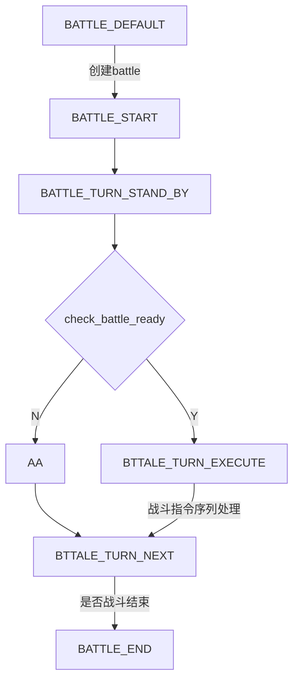

战斗系统

战斗对象 

Battle对象：

battle关联battle里的actor
还有回合流程控制

进行回合控制，里面包含了actors， actor分为player，npc，summon
player， player_summon的指令由客户端上发
npc的指令战斗系统根据npc的战斗指令状态机自行生成

服务端战斗指令处理流程：

先根据actor的速度来计算出战斗指令的执行顺序

根据顺序遍历每个指令，计算指令产生的hp，mp变化以及buff状态变化，同时计算出客户端的表现效果

下发客户端表现需要的数据

客户端做表现

战斗中的特殊情况：

NPC可以被击飞，击飞后的npc被销毁，移出战斗系统

玩家逃跑，不是唯一玩家逃跑，逃跑玩家被移出战斗系统，逃跑玩家脱战，战斗系统继续

唯一玩家逃跑，战斗结束

玩家BB被击飞，移出战斗系统。
玩家BB被召唤，加入战斗系统。

玩家战斗执行发送，既包含自己的，也包含所携带BB的

处理战斗指令的时候，就不必关心战斗指令的来源了。

战斗指令处理的时候可能出现的情况：

actor被移出，移入战斗系统。actor被击飞 or 死亡

战斗指令 cmd
战斗指令表现 skill
战斗指令效果 actor属性计算

作用对象：  己方 对方
物理攻击
	剑荡四方 
法术攻击 龙卷雨击
	封印
		催眠符
	辅助
		加血
暗器
特技
道具

技能表现：

技能效果：

buff表现：

buff效果：

Battle

AddActor
RemoveActor
GetTeamActors
AddCommand
RemoveCommand
ChangeBattleState

Command
type 吃药 暗器 物品。。。
data
skill

Actor

GetBattle
GetTeam
GetTargetTeam
GetSummon
ChangeSummon
SetSummon
Type : NPC player

Skill

Buff

